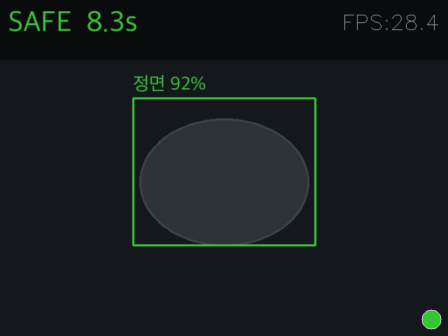
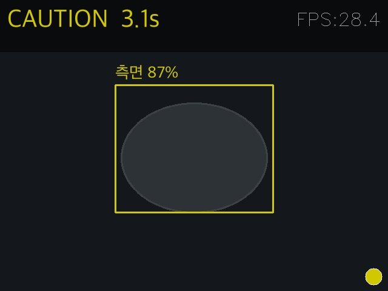
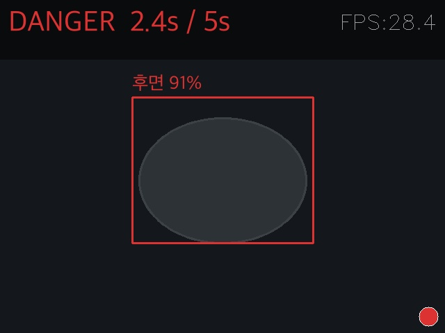
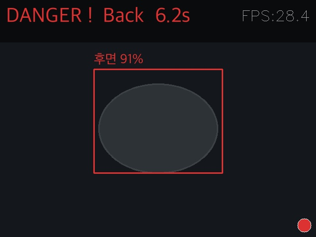
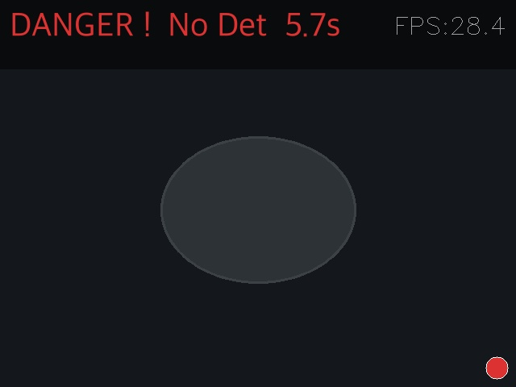
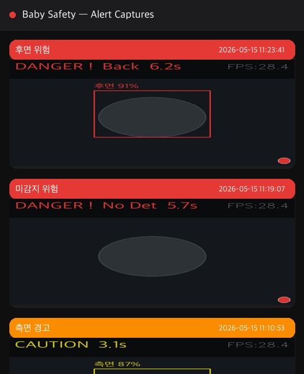

# 영유아 수면 안전 모니터링 시스템

YOLOv8n 기반 실시간 아기 자세 감지 — 정면 / 측면 / 후면 3클래스 분류 및 위험 알림

---

## 화면 데모

### 실시간 감지 상태

| SAFE 🟢 | CAUTION 🟡 | DANGER 🔴 |
|:---:|:---:|:---:|
|  |  |  |
| 정면 감지 — 누적 시간 표시 | 측면 감지 — 5초 도달 시 캡처 | 후면 감지 — 5초 카운트다운 |

### 경고 알림 (5초 도달)

| DANGER ! — 후면 5초↑ 🔴 | DANGER ! — 미감지 5초↑ 🔴 |
|:---:|:---:|
|  |  |
| 후면 자세 5초 이상 지속 → 캡처 저장 | 아기 미감지 5초 이상 → 캡처 저장 |

### Alert 이미지 서버 (앱/브라우저)

| Alert Server Web UI |
|:---:|
|  |
| `http://파이IP:8080/` 접속 — 캡처 이미지 목록 확인 |

---

## 프로젝트 개요

신생아 및 영유아는 분리 수면 중 스스로 자세를 바꾸거나 위험 상황을 인지·대처하는 능력이 없습니다.  
영아 돌연사 증후군(SIDS)의 주요 원인 중 하나는 수면 중 기도 막힘으로, 아기가 엎드린 자세(후면)를 유지할 때 질식 위험이 크게 높아집니다.

부모가 항상 옆에서 지켜볼 수 없는 분리 수면 환경에서 **실시간으로 자세를 감지하고 위험 상태를 즉시 알리는 시스템**을 구현했습니다.

---

## 주요 기능

- **3클래스 자세 감지**: 정면(SAFE) / 측면(CAUTION) / 후면(DANGER)
- **경고 캡처 저장**: 아래 조건 충족 시 `captures/` 폴더에 자동 저장
  - 측면(CAUTION) 5초 이상 지속
  - 후면(DANGER) 5초 이상 지속
  - 미감지(No Detection) 5초 이상 지속
- **Alert 이미지 서버**: Flask 기반 — 앱/브라우저에서 캡처 이력 확인
- **누적 감지 시간 표시**: 현재 상태 지속 시간 실시간 표시
- **시간적 평활화**: 최근 20프레임 다수결로 오탐 방지
- **LED 상태 표시**: 아두이노 연동 — 초록 / 노랑 / 빨강
- **FPS 표시**: 상단 오버레이 우측 실시간 표시

---

## 모델 성능

### 학습 결과 (Training Curves)


### Precision-Recall Curve


### Confusion Matrix (Normalized)


---

## 하드웨어 구성

| 구분 | 장비 | 역할 |
|---|---|---|
| 영상 입력 | USB 웹캠 | 실시간 영상 스트리밍 |
| 엣지 디바이스 | 라즈베리파이 4 | 현장 영상 수신 및 추론 |
| 마이크로컨트롤러 | 아두이노 우노 | LED 상태 출력 |
| 알림 출력 | LED (초록/노랑/빨강) | 로컬 경보 출력 |

### LED 상태 표시

| 안전 🟢 | 주의 🟡 | 위험 🔴 |
|:---:|:---:|:---:|
|  |  |  |


---

## 시스템 구조

```
mini_project_01/
├── vision/
│   ├── baby_monitor_v4.py     # 실시간 감지 메인 스크립트
│   └── alert_server.py        # 캡처 이미지 조회 Flask 서버
├── ai/
│   ├── train_v4.py            # YOLOv8n 학습 스크립트
│   ├── download_dataset.py    # Roboflow 데이터셋 다운로드·병합
│   └── dataset_v4/            # 학습 데이터 (gitignore)
├── hw/
│   └── led_control/
│       └── led_control.ino    # 아두이노 LED 제어
├── captures/                  # 경고 캡처 이미지 저장 폴더 (자동 생성)
├── colab_train.ipynb          # Google Colab GPU 학습 노트북
├── requirements.txt
└── requirements-pi.txt        # 라즈베리파이 전용
```

---

## 설치 및 실행

### 1. 환경 설정
```bash
python3 -m venv venv
source venv/bin/activate
pip install -r requirements.txt        # PC / Mac
pip install -r requirements-pi.txt    # 라즈베리파이
```

### 2. 웹캠 실시간 감지
```bash
python3 vision/baby_monitor_v4.py --source 0
```

### 3. 영상 파일 테스트
```bash
python3 vision/baby_monitor_v4.py --source ai/sample3.mp4
```

### 4. Alert 이미지 서버 실행
```bash
python3 vision/alert_server.py
# → http://파이IP:8080/ 접속
```

#### Alert API

| 메서드 | 경로 | 설명 |
|---|---|---|
| GET | `/` | 캡처 이미지 목록 웹 UI |
| GET | `/api/alerts` | 이미지 목록 JSON |
| GET | `/image/<filename>` | 이미지 파일 |
| DELETE | `/api/alerts/<filename>` | 이미지 삭제 |

### 5. 모델 재학습 (Google Colab 권장)
- `colab_train.ipynb` 를 Colab에서 열고 T4 GPU로 실행
- 학습 완료 후 `best.pt` 를 `ai/runs/baby_monitor_v4/weights/best.pt` 로 교체

---

## 경고 캡처 동작 흐름

```
실시간 감지
    │
    ├─ SAFE   → 상태 유지 시간 표시
    ├─ CAUTION → 5초 이상 지속 → captures/CAUTION_{timestamp}.jpg 저장
    ├─ DANGER  → 5초 이상 지속 → captures/DANGER_BACK_{timestamp}.jpg 저장
    └─ 미감지  → 5초 이상 지속 → captures/DANGER_NODET_{timestamp}.jpg 저장
                      │
                      └─ alert_server.py → http://파이IP:8080/ 에서 확인
```

> 동일 이벤트에서는 1회만 캡처 (상태 재진입 시 자동 리셋)  
> 캡처 이미지에는 상태 텍스트·바운딩박스·타이머가 포함됨

---

## 기술 스택

| 영역 | 기술 |
|---|---|
| AI 추론 | YOLOv8n (Ultralytics) |
| 영상 처리 | OpenCV, PIL |
| 학습 환경 | Google Colab T4 GPU |
| 데이터셋 | Roboflow (SabiCare — 3,384장) |
| 이미지 서버 | Flask |
| 하드웨어 | Arduino Uno, Raspberry Pi 4 |
| 언어 | Python 3.11 |
