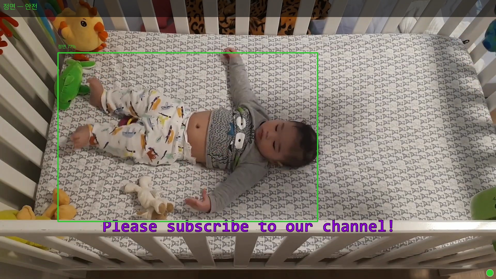
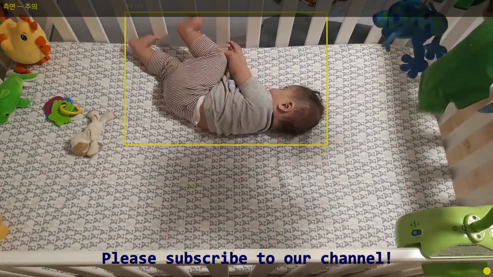
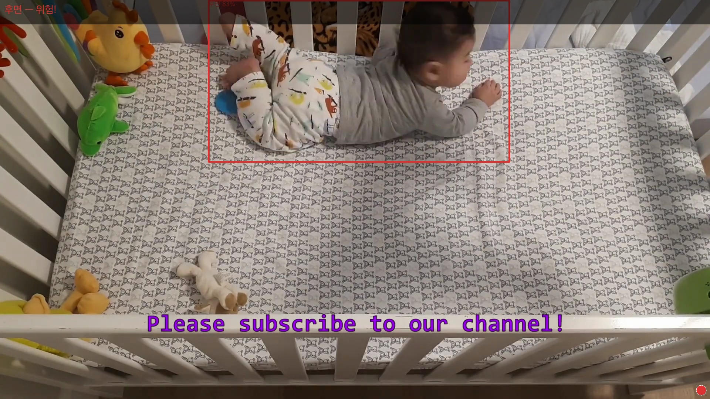
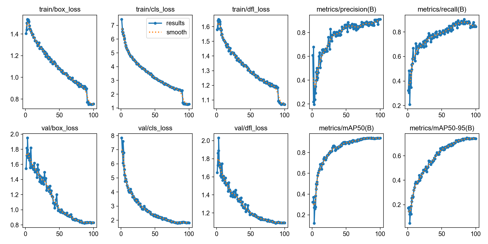
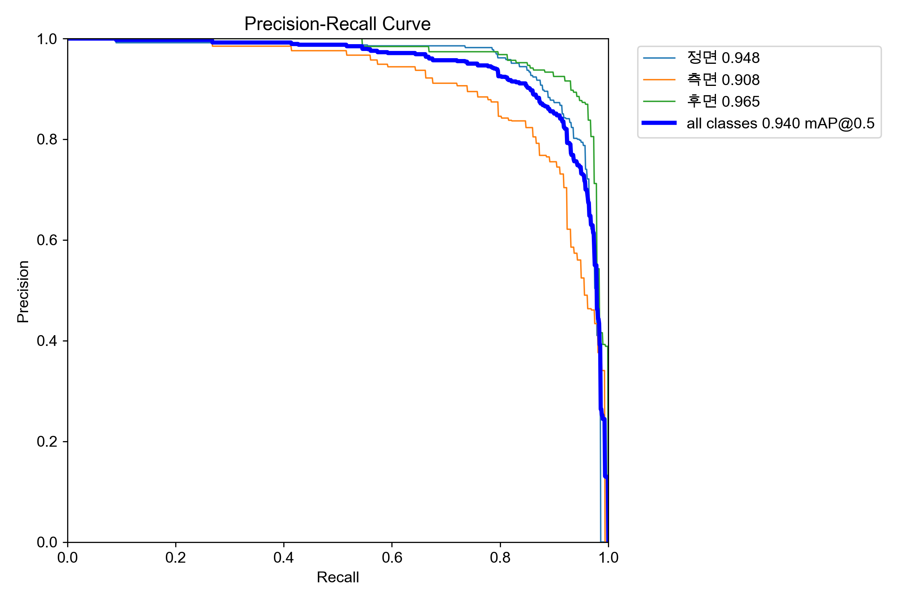
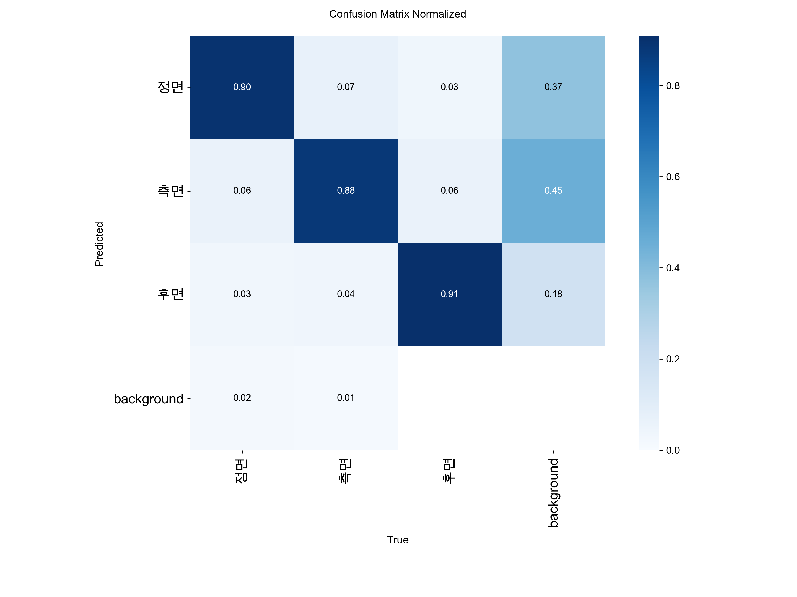

# 영유아 수면 안전 모니터링 시스템

YOLOv8n 기반 실시간 아기 자세 감지 — 정면 / 측면 / 후면 3클래스 분류 및 위험 알림

---

## 데모

| 정면 — 안전 🟢 | 측면 — 주의 🟡 | 후면 — 위험 🔴 |
|:---:|:---:|:---:|
|  |  |  |

> 오버헤드(위에서 내려보는) 카메라 기준 실시간 감지 결과

---

## 프로젝트 개요

신생아 및 영유아는 분리 수면 중 스스로 자세를 바꾸거나 위험 상황을 인지·대처하는 능력이 없습니다.  
영아 돌연사 증후군(SIDS)의 주요 원인 중 하나는 수면 중 기도 막힘으로, 아기가 엎드린 자세(후면)를 유지할 때 질식 위험이 크게 높아집니다.

부모가 항상 옆에서 지켜볼 수 없는 분리 수면 환경에서 **실시간으로 자세를 감지하고 위험 상태를 즉시 알리는 시스템**을 구현했습니다.

---

## 주요 기능

- **3클래스 자세 감지**: 정면(안전) / 측면(주의) / 후면(위험)
- **위험 지속 알림**: 후면 자세 5초 이상 지속 시 경보
- **시간적 평활화**: 최근 20프레임 다수결로 오탐 방지
- **LED 상태 표시**: 아두이노 연동 — 초록 / 노랑 / 빨강
- **영상 루프 지원**: 파일 재생 시 타이머 자동 초기화
- **FPS 표시 및 실시간 오버레이**

---

## 모델 성능

### 학습 결과 (Training Curves)


### Precision-Recall Curve


### Confusion Matrix (Normalized)


---

## 하드웨어 구성

| 구분 | 장비 | 역할 |
|---|---|---|
| 영상 입력 | USB 웹캠 | 실시간 영상 스트리밍 |
| 엣지 디바이스 | 라즈베리파이 4 | 현장 영상 수신 및 추론 |
| 마이크로컨트롤러 | 아두이노 우노 | LED 상태 출력 |
| 알림 출력 | LED (초록/노랑/빨강) | 로컬 경보 출력 |

### LED 상태 표시

| 안전 🟢 | 주의 🟡 | 위험 🔴 |
|:---:|:---:|:---:|
|  |  |  |


---

## 시스템 구조

```
mini_project_01/
├── vision/
│   └── baby_monitor_v4.py     # 실시간 감지 메인 스크립트
├── ai/
│   ├── train_v4.py            # YOLOv8n 학습 스크립트
│   ├── download_dataset.py    # Roboflow 데이터셋 다운로드·병합
│   └── dataset_v4/            # 학습 데이터 (gitignore)
├── hw/
│   └── led_control/
│       └── led_control.ino    # 아두이노 LED 제어
├── colab_train.ipynb          # Google Colab GPU 학습 노트북
└── requirements.txt
```

---

## 설치 및 실행

### 1. 환경 설정
```bash
python3 -m venv venv
source venv/bin/activate
pip install -r requirements.txt
```

### 2. 웹캠 실시간 감지
```bash
python3 vision/baby_monitor_v4.py --source 0
```

### 3. 영상 파일 테스트
```bash
python3 vision/baby_monitor_v4.py --source ai/sample3.mp4
```

### 4. 모델 재학습 (Google Colab 권장)
- `colab_train.ipynb` 를 Colab에서 열고 T4 GPU로 실행
- 학습 완료 후 `best_new.pt` 를 `ai/runs/baby_monitor_v4/weights/best.pt` 로 교체

---

## 기술 스택

| 영역 | 기술 |
|---|---|
| AI 추론 | YOLOv8n (Ultralytics) |
| 영상 처리 | OpenCV, PIL |
| 학습 환경 | Google Colab T4 GPU |
| 데이터셋 | Roboflow (SabiCare — 3,384장) |
| 하드웨어 | Arduino Uno, Raspberry Pi 4 |
| 언어 | Python 3.11 |
