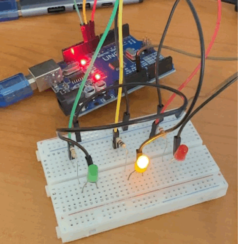
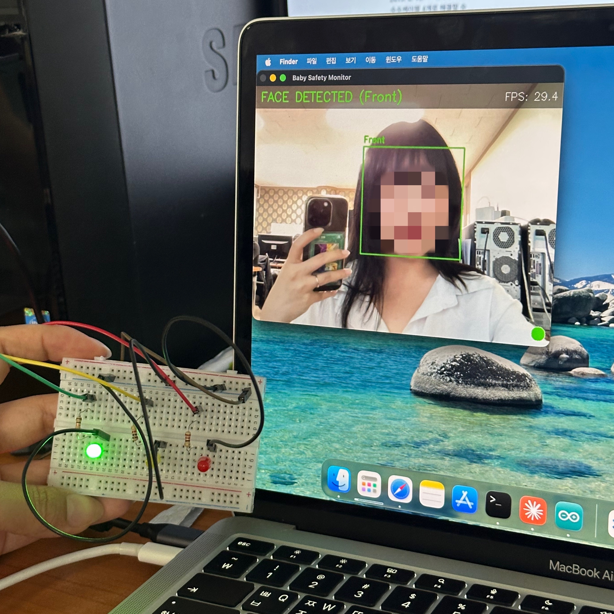
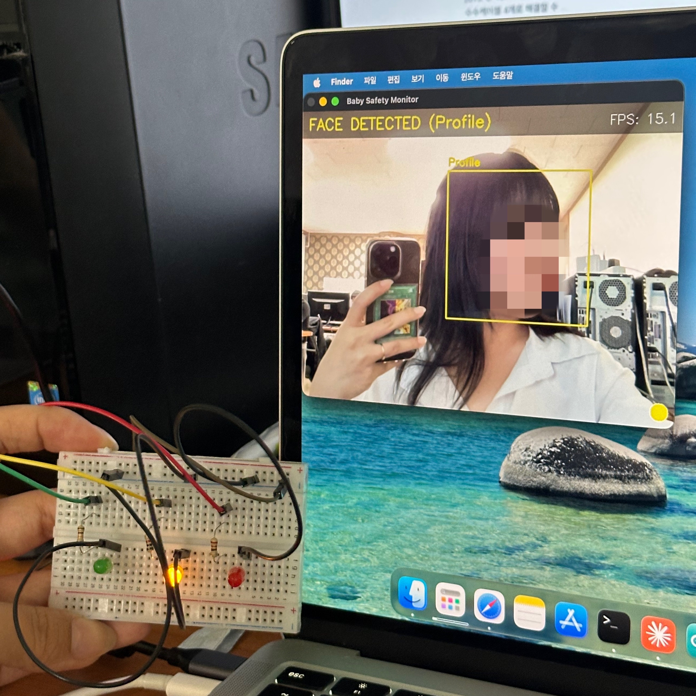
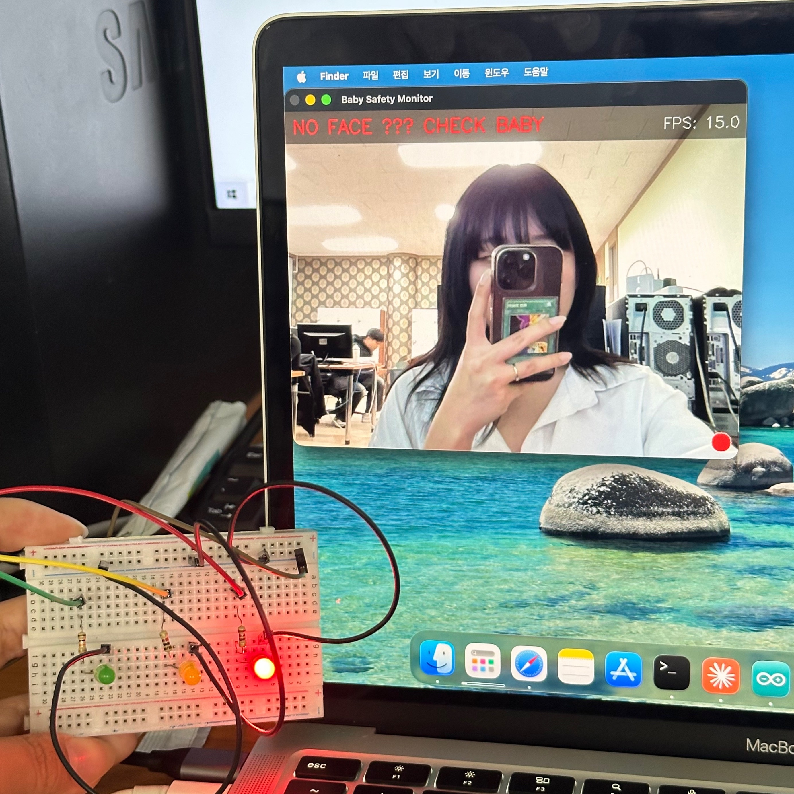

#  1회차 구현 내용

### 1. 개발 환경 구성

- 프로젝트 전용 가상환경 생성
- GitHub 리포지토리 생성

---

### 2. 아두이노 3색 LED 배선

감지 상태를 직관적으로 표시하기 위해 3색 LED를 아두이노에 연결했다.

| LED 색상 | 핀 | 저항 | 의미 |
|----------|----|------|------|
| 🔴 RED | D9 | 220Ω | 얼굴 미감지 (위험) |
| 🟡 YELLOW | D10 | 220Ω | 옆모습 감지 |
| 🟢 GREEN | D11 | 220Ω | 정면 얼굴 감지 (안전) |

- 각 LED 긴 다리(+) → 220Ω 저항 → 디지털 핀
- 짧은 다리(-) → GND 공통 버스




---

### 3. `hw/led_control.ino` — 시리얼 수신 LED 제어

PC(Python)에서 시리얼로 전송한 명령어 1바이트를 수신하여 해당 LED를 점등한다.

**수신 명령어**

| 명령 | 동작 |
|------|------|
| `G` | GREEN ON (정면 감지) |
| `Y` | YELLOW ON (옆모습 감지) |
| `R` | RED ON (얼굴 미감지) |
| `X` | 전체 OFF |

**주요 구현 포인트**

- `switch-case` 로 명령어 분기, `default` 에서 노이즈 문자 무시
- `allOff()` 함수로 명령마다 나머지 LED 소등 후 해당 LED 점등
- 시작 시 `startupBlink()` 로 3색 순서 점등 → 배선 이상 즉시 확인 가능

```cpp
void loop() {
  if (Serial.available() > 0) {
    char cmd = Serial.read();
    switch (cmd) {
      case 'G': allOff(); digitalWrite(PIN_GREEN,  HIGH); break;
      case 'Y': allOff(); digitalWrite(PIN_YELLOW, HIGH); break;
      case 'R': allOff(); digitalWrite(PIN_RED,    HIGH); break;
      case 'X': allOff();                                 break;
    }
  }
}
```

---

### 4. `vision/face_led.py` — 얼굴 감지 + LED 연동

OpenCV Haar Cascade로 웹캠 영상에서 얼굴을 실시간 감지하고,  
결과를 pyserial로 아두이노에 전송하여 LED를 제어한다.

**감지 우선순위**

```
웹캠 영상
  ├── 1순위: 정면 감지 (haarcascade_frontalface_default.xml)
  │         → 'G' 전송 → GREEN LED
  ├── 2순위: 옆면 감지 (haarcascade_profileface.xml)
  │         좌우 반전 트릭으로 양방향 감지
  │         → 'Y' 전송 → YELLOW LED
  └── 미감지
            → 'R' 전송 → RED LED
```

**주요 구현 포인트**

- `cv2.equalizeHist()` 로 대비 향상 → 저조도 환경 감지율 개선
- 정면 감지 시 옆면 감지 건너뜀 → 연산 절약 + 오탐 방지
- 좌우 반전(`cv2.flip`) 후 재감지로 오른쪽 옆모습도 지원
  - Haar Cascade profile 모델이 왼쪽 옆면만 학습되어 있어 필요한 처리
- 쿨다운(0.3초)으로 시리얼 중복 전송 방지
- `cv2.getTickCount()` 로 실시간 FPS 측정 및 화면 오버레이
- 포트 자동 탐색 (`serial.tools.list_ports`)
- 종료 시 `X` 전송 → LED 전체 OFF 후 시리얼 포트 정상 종료

**화면 오버레이 구성**

- 좌상단: 현재 감지 상태 텍스트
- 우상단: 실시간 FPS
- 우하단: 현재 LED 상태 색상 원
- 바운딩 박스: 정면(초록), 옆면(노랑)








---

## 🔍 트러블슈팅

| 문제 | 원인 | 해결 |
|------|------|------|
| 오른쪽 옆모습 미감지 | Haar Cascade profile이 왼쪽만 학습 | 프레임 좌우 반전 후 재감지, 좌표 복원 |

---

## 📐 시스템 구성도

```
[아두이노 우노]          [맥북 M1]
  D9  → RED LED  ←──── 'R'  ←─┐
  D10 → YELLOW LED ←── 'Y'  ←─┤  face_led.py
  D11 → GREEN LED  ←── 'G'  ←─┤  (OpenCV + pyserial)
  GND (공통)            'X'  ←─┘
        ↑ USB 시리얼         ↑
                        [웹캠]
                    얼굴 감지 영상 입력
```

